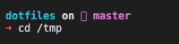
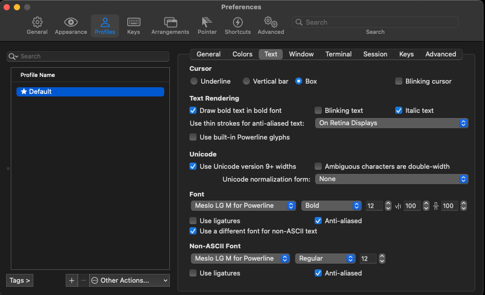

# dotfiles

My personal dotfiles built on top of [thoughtbot/dotfiles](https://github.com/thoughtbot/dotfiles). 

## Install

Clone this repo, this README assumes you clone the repo into `$HOME/Dev/dotfiles`, and then create a symlink:

```shell
ln -s $HOME/Dev/dotfiles $HOME/dotfiles-local
```

Then install [thoughtbot/dotfiles](https://github.com/thoughtbot/dotfiles). 

Create some folders used by vim:

```shell
mkdir -p ~/.vim/backups ~/.vim/swaps ~/.vim/undo
```

Install Tomorrow-Night colorscheme for vim

```shell
mkdir -p $HOME/.vim/colors/ &&  curl https://raw.githubusercontent.com/chriskempson/tomorrow-theme/master/vim/colors/Tomorrow-Night.vim --output $HOME/.vim/colors/Tomorrow-Night.vim
```

Run `rcup` to generate some more symlinks.


After the above steps, install [spaceship](https://github.com/denysdovhan/spaceship-prompt).

## Helper scripts


### Update submodules

In order to update submodules run `$HOME/scripts/update-submodules.sh` then just
push back the changes to your repository.

## Configurations file directory

The enviroment variable `$CONFIGS_DIR` is set to `$HOME/.bash-configs` or `$HOME/.zsh-configs` depending on your
`$SHELL`. This directory contains all the configurations files that are sourced by the shell's main configuration
file. 

## Custom commands
This feature is based on [Mathias Bynens](https://github.com/mathiasbynens/dotfiles) dotfiles and lets
you add custom commands without forking this project. Basically if there is an `extra.sh` or `extra.zsh` file
inside `$CONFIGS_DIR` it will be sourced. Put inside this file your custom commands or stuff you do not want to make public.


# iTerm2/VS code font issues

To avoid the following issue:



install the powerline fonts as shown [here](https://fmacedoo.medium.com/oh-my-zsh-with-powerline-fonts-pretty-simple-as-you-deserve-fbe7f6d23723)

and then update the iterm preferences as shown in this screenshot:




## Font fix for visual studio

Your user settings should include the following:

```json
{
    "workbench.editor.enablePreview": false,
    "terminal.explorerKind": "external",
    "terminal.external.osxExec": "iTerm.app",
    "terminal.integrated.fontFamily": "Meslo LG M for Powerline"
}
```